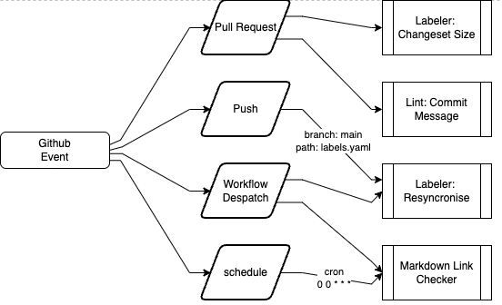

# Integration Actions

A number of actions are added to the Repository, trigged by events issued within Github.

A filter is applied on the events, to filter which actions to process.

## Labeler Change Set Size

Workflow to assign labels based on pull request change sizes

|Lines Changed | Label |
|---|---|
| 0 | XS|
|  10| S|
|  30| M|
|  100| L|
|  500| XL |
|  1000| XXL |

## Laberler Resyncronise

Workflow to to sync labels from a config file to the repository.

## Markdown Link Checker

Workflow using ***Lychee***, a fast, async, stream-based link checker written in Rust.

Finds broken hyperlinks and mail addresses inside Markdown, HTML, reStructuredText, or any other text file or website

Opens a new issue, or updates an exisiting issue to track problems detected

## Commit Message Linter

Workflow to check commit messages for Conventional Commits formatting.

Adds a comment to the pull request to communicate any issues found, to allow the user fix thier GIT History and push the changes back to the branch.
